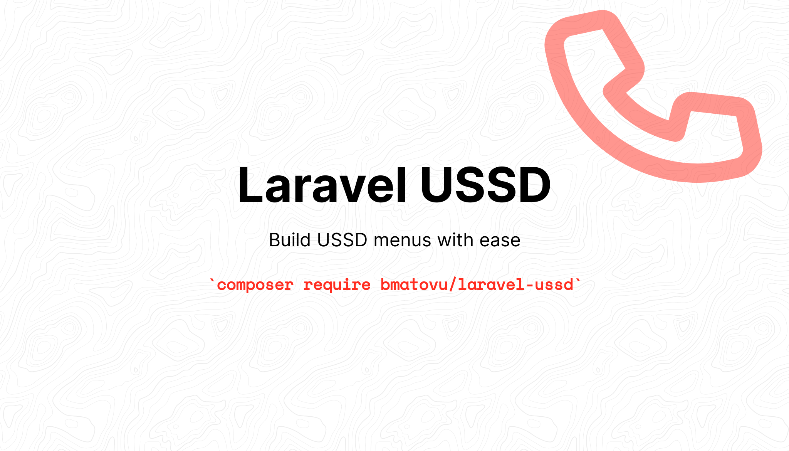

[](https://packagist.org/packages/bmatovu/laravel-ussd)
[](https://github.com/mtvbrianking/laravel-ussd/actions?query=workflow:run-tests)
[](https://scrutinizer-ci.com/g/mtvbrianking/laravel-ussd/?branch=master)
[](https://scrutinizer-ci.com/g/mtvbrianking/laravel-ussd/?branch=master)
[](https://mtvbrianking.github.io/laravel-ussd)

## Table of Contents

- [Overview](#overview)
- [Installation](#installation)
  * [Configurations](#configurations)
- [Usage](#usage)
  * [Example](#example)
  * [Validation](#validation)
  * [Simulator](#simulator)
- [Constructs](#constructs)
  * [Variable](#variable)
  * [Question](#question)
  * [Response](#response)
  * [Options](#options)
  * [If](#if)
  * [Choose](#choose)
  * [Action](#action)
  * [List](#list)
- [Advanced](#advanced)
  * [Retries](#retries)
  * [Comparisons](#comparisons)
  * [Cache](#cache)
  * [Parser](#parser)
  * [Simulation](#simulation)
  * [JSON](#json)
- [Testing](#testing)
- [Security](#security)
- [Contribution](#contribution)
- [Alternatives](#alternatives)
- [License](#license)

## Overview

Effortlessly construct intricate USSD menus with streamlined efficiency by replacing convoluted nests of PHP files with the simplicity of XML-based menu construction. This approach allows for seamless execution similar to standard PHP scripts, minimizing code complexity and  enhancing readability.

Let's explore an example of a simple SACCO USSD application.

```xml
<?xml version="1.0" encoding="UTF-8"?>
<menu name="sacco"
    xmlns:xsi="http://www.w3.org/2001/XMLSchema-instance"
    xsi:noNamespaceSchemaLocation="menu.xsd">
    <action name="check-user"/>
    <options header="SACCO Services" noback="no">
        <option text="Savings">
            <list header="Saving Accounts" provider="saving-accounts" prefix="account"/>
            <options header="Savings">
                <option text="Deposit">
                    <options header="Deposit From:">
                        <option text="My Number">
                            <variable name="sender" value="{{phone_number}}"/>
                        </option>
                        <option text="Another Number">
                            <question name="sender" text="Enter Phone Number: "/>
                        </option>
                    </options>
                    <question name="amount" text="Enter Amount: "/>
                    <action name="deposit"/>
                </option>
                <option text="Withdraw">
                    <options header="Withdraw To:">
                        <option text="My Number">
                            <variable name="receiver" value="{{phone_number}}"/>
                        </option>
                        <option text="Another Number">
                            <question name="receiver" text="Enter Phone Number: "/>
                        </option>
                    </options>
                    <question name="amount" text="Enter Amount: "/>
                    <action name="withdraw"/>
                </option>
                <option text="Check Balance">
                    <action name="check-balance" text="To see your balance, enter PIN: "/>
                </option>
                <option text="Check Transaction">
                    <question name="transaction_id" text="Enter Transaction ID: "/>
                    <action name="check-transaction"/>
                </option>
            </options>
        </option>
        <option text="Loans">
            <response text="Coming soon."/>
        </option>
    </options>
</menu>
```

## Installation

Install the package via the Composer.

```bash
composer require bmatovu/laravel-ussd
```
### Configurations

```bash
php artisan vendor:publish --provider="Bmatovu\Ussd\UssdServiceProvider" --tag="config"
```

## Usage

### Example

> menus/menu.xml

```xml
<?xml version="1.0" encoding="UTF-8" ?>
<menu name="demo">
    <question name="guest" text="Enter Name: "/>
    <response text="Hello {{guest}}."/>
</menu>
```

> app/Http/Controller/Api/UssdController

```php
use Bmatovu\Ussd\Ussd;
use Illuminate\Http\Request;
use Illuminate\Http\Response;

/**
 * @see https://developers.africastalking.com/docs/ussd/overview
 */
class UssdController extends Controller
{
    public function __invoke(Request $request): Response
    {
        try {
            $output = Ussd::make($menu, $request->session_id)
                ->handle($request->text);
        } catch(\Exception $ex) {
            return response('END ' . $ex->getMessage());
        }

        return response('CON ' . $output);
    }
}
```

See more examples in the [demo repo](https://github.com/mtvbrianking/ussd-demo/tree/master/app/Http/Controllers/Api)

### Validation

**Publish the menu schema**

Defaults to using the schema bundled within the package if none is present in your menus path, usually `menus/menu.xsd`.

```bash
php artisan vendor:publish --provider="Bmatovu\Ussd\UssdServiceProvider" --tag="schema"
```

Validate your menu files against the schema

```bash
php artisan ussd:validate
```

**VSCode**

The [RedHat XML package](https://marketplace.visualstudio.com/items?itemName=redhat.vscode-xml) is useful for realtime XSD validations and suggestions.

```diff
- <menu name="demo">
+ <menu name="demo"
+     xmlns:xsi="http://www.w3.org/2001/XMLSchema-instance"
+     xsi:noNamespaceSchemaLocation="menu.xsd">
      <question name="guest" text="Enter Name: "/>
      <response text="Hello {{guest}}."/>
  </menu>
```

### Simulator

The package comes with a CLI USSD simulator supporting a handful of populator aggregators.

Publish the simulator config file to get started. Update the aggregator and the USSD service endpoint in the config file.

```bash
php artisan vendor:publish --provider="Bmatovu\Ussd\UssdServiceProvider" --tag="simulator"
```
Usage:

```bash
./vendor/bin/ussd --help
./vendor/bin/ussd 256772100103
```

**Aggregators**

- Africastalking
- Comviva (Airtel & MTN)

_If you're an aggregator missing from the current list reachout to have you added. Or simply send a pull request_

## Constructs

### Variable

```php
$color = 'blue';
```

```xml
<variable name="color" value="blue"/>
```

**Note**: This tag has no output

### Question

```php
$username = readline('Enter username: ');
```

```xml
<question name="username" text="Enter username: "/>
```

### Response

```php
exit('Thank you for banking with us.');
```

```xml
<response text="Thank you for banking with us."/>
```

**Note**: this tag throws an exception to mark a break in the normal flow.

### Options

Options are like named grouped `if, else-if` statements that allow a user to navigate to a predefined path.

```php
$choice = readline('Choose service [1. Deposit, 2. Withdraw]: ');

if($choice === 1) {
    // deposit...
} elseif($choice === 2) {
    // withdraw...
}
```

```xml
<options header="Choose service">
    <option text="Deposit">
        <!-- ... -->
    </option>
    <option text="Withdraw">
        <!-- ... -->
    </option>
</options>
```

**Disable backward navigation**

By default `0) Back` option will be added to the options rendered. Use the attribute `noback` to disable this behavior.

This behavior may only be used for nested `<options>` tags.

```xml
<options header="Choose service" noback="no">
    <!-- ... -->
</options>
```

### If

Can contain any other tags inclusive of the IF tag itself.

```php
if($role == 'treasurer') {
    // ...
}
```

```xml
<if key="role" value="treasurer">
    <!-- ... -->
</if>
```

### Choose

This construct should cover for `if-else`, `if-elseif-else`, and the native `switch`.

**Example #1**

```php
if($role == 'treasurer') {
    // ...
} else {
    // ...
}
```

```xml
<choose>
    <when key="role" value="treasurer">
        <!-- ... -->
    </when>
    <otherwise>
        <!-- ... -->
    </otherwise>
</choose>
```

**Example #2**

```php
if($role == 'treasurer') {
    // ...
} elseif($role == 'member') {
    // ...
} else {

}
```

```xml
<choose>
    <when key="role" value="treasurer">
        <!-- ... -->
    </when>
    <when key="role" value="member">
        <!-- ... -->
    </when>
    <otherwise>
        <!-- ... -->
    </otherwise>
</choose>
```

**Example #3**

```php
switch ($role) {
    case "treasurer":
        // ...
        break;
    case "member":
        // ...
        break;
    default:
        // ...
}
```

```xml
<choose>
    <when key="role" value="treasurer">
        <!-- ... -->
    </when>
    <when key="role" value="memeber">
        <!-- ... -->
    </when>
    <otherwise>
        <!-- ... -->
    </otherwise>
</choose>
```

### Action

The action tag gives you the ability to perform more customized operations.

```php
$userInfo = \App\Ussd\Actions\GetUserInfoAction('256732000000');
```

```xml
<!-- Actions can access all variable in cache -->
<action name="get-user-info"/>

<!-- Pass by value -->
<action name="get-user-info" msisdn="256732000000"/>

<!-- Pass by reference -->
<action name="get-user-info" msisdn="{{msisdn}}"/>
```

Note: Actions behave just like the normal tag i.e they can take input from a user or cache, and may or may not return output.

### List

Lists are used to display dynamic items. E.g: user accounts fetched on demand.

Provider is the class providing the list of items. Each item must contain an `id` and a `label`.

```php
$listItems = (new \App\Ussd\Providers\SavingAccountsProvider)->load();

[
    [
        'id' => 4364852, // account_id 
        'label' => '01085475262', // account_number
    ],
];
```

```xml
<list header="Saving Accounts" provider="saving-accounts" prefix="account"/>
```

## Advanced

### Retries

It's also possible to set the number of retries and a custom error message.

**Question**

Using regex patterns.

```diff
  <question
      name="pin"
      text="Enter PIN: "
+     retries="1"
+     pattern="^[0-9]{5}$"
+     error="You entered the wrong PIN. Try again" />
```

**Options & Lists**

Validation is against the possible list options.

```diff
  <options
      header="Choose a test"
+     retries="1"
+     error="Choose the correct number:">
      ...
  </option>
```

```diff
  <list 
      header="Saving Accounts" 
      provider="saving-accounts" 
      prefix="account" 
+     retries="1"
+     error="Choose the correct number:"/>
```

Note: retries in <action> tags are discouraged because the action tags are not aware of tags preceeding them.

### Comparisons

The <if> and <when> tags allow comparisions.

Falls back to `eq` if the `cond` is not set or it's unsupported.

```xml
<if key="age" value="18">
<if key="age" cond="eq" value="18">
```

| Type | Conditions |
| :--- | :--------- |
| Numbers | - lt<br/>- gt<br/>- lte<br/>- gte<br/>- eq<br/>- ne<br/>- btn |
| Strings | - str.equals<br/>- str.not_equals<br/>- str.starts<br/>- str.ends<br/>- str.contains |
| Regex | - regex.match |
| Arrays | - arr.in<br/>- arr.not_in |
| Dates | - date.equals<br/>- date.before<br/>- date.after<br/>- date.between |
| Time | - time.equals<br/>- time.before<br/>- time.after<br/>- time.between |


### Cache

This package persists USSD session data in cache. Each key is prefixed with the `session_id` and it automatically expires after the configured `ttl`.

**Accessing variables**

```xml
<variable name="color" value="blue"/>
```

```php
$this->store->get('color'); // blue

Cache::store($driver)->get("{$sessionId}color"); // blue
```

**Reusing existing variables**

```xml
<variable name="msg" value="Bye bye."/>

<response text="{{msg}}"/> <!-- Bye bye -->
```

### Parser

**Save default variables**

Example for saving any variable from the incoming USSD request.

```php
Ussd::make($menu, $request->session_id)
    ->save([
        'phone_number' => $request->phone_number,
    ])
    ->handle(...);
```

**Use custom menu entry point**

By default the parsing starts at the 1st element in your menu file, i.e `/menu/*[1]`.

If you wish to start from a different point or use a custom menu file structure. Here's how to go about it...

```php
Ussd::make($menu, $request->session_id)
    ->entry("/menus/menu[@name='sacco']/*[1]")
    ->handle(...);
```

See: [xpath playground](http://xpather.com)

### Simulation

You can extend the USSD simulator with your aggregator of choice by simply registering it in the simulator config file.

The provider class should implement `Bmatovu\Ussd\Contracts\Aggregator`.

> simulator.json

```diff
  {
+     "aggregator": "africastalking",
      "aggregators": {
+         "hubtel": {
+             "provider": "App\\Ussd\\Simulator\\Africastalking",
+             "uri": "http://localhost:8000/api/ussd/africastalking",
+             "service_code": "*123#"
+         }
      }
  }
```

### JSON

**Why use XML 🥴 and not JSON 😉?**

XML is better suited for writing constructs resembling programming languages. It offers straightforward validation of schemas. Additionally, XML is both more compact and readable.

**Compare the snippets below...**

```xml
<menu name="demo">
    <question name="guest" text="Enter Name: "/>
    <response text="Hello {{guest}}."/>
</menu>
```

```json
{
    "@name": "demo",
    "question": {
        "@name": "guest",
        "@text": "Enter Name:"
    },
    "response": {
        "@text": "Hello {{guest}}."
    }
}
```

## Testing

To run the package's unit tests, run the following command:

``` bash
composer test
```

## Security

If you find any security related issues, please contact me directly at [mtvbrianking@gmail.com](mailto:mtvbrianking@gmail.com) to report it.

## Contribution

If you wish to make any changes or improvements to the package, feel free to make a pull request.

Note: A contribution guide will be added soon.

## Alternatives

- [sparors/laravel-ussd](https://github.com/sparors/laravel-ussd) takes a completely different approach on building USSD menus.

## License

The MIT License (MIT). Please see [License file](license.txt) for more information.
